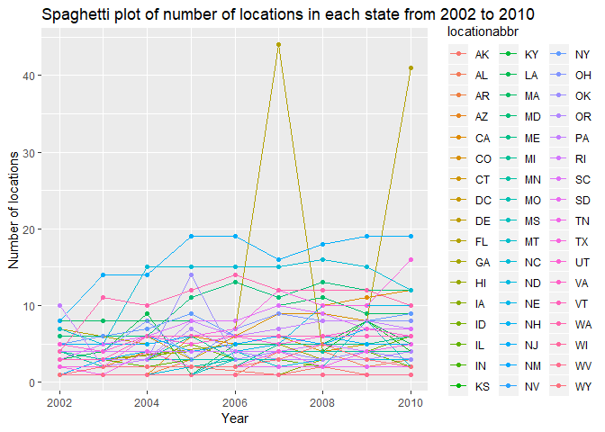
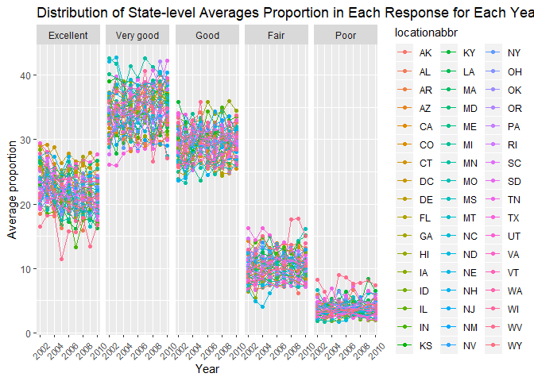
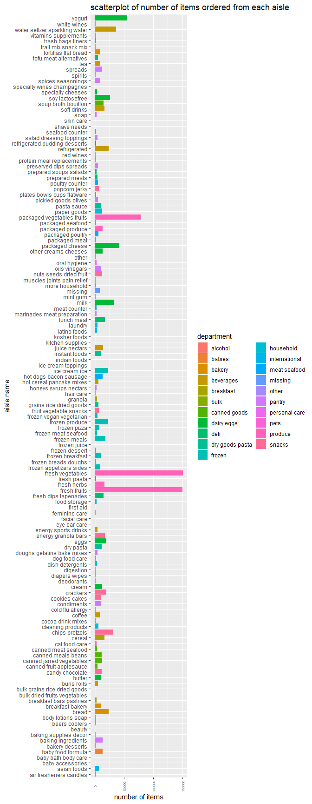
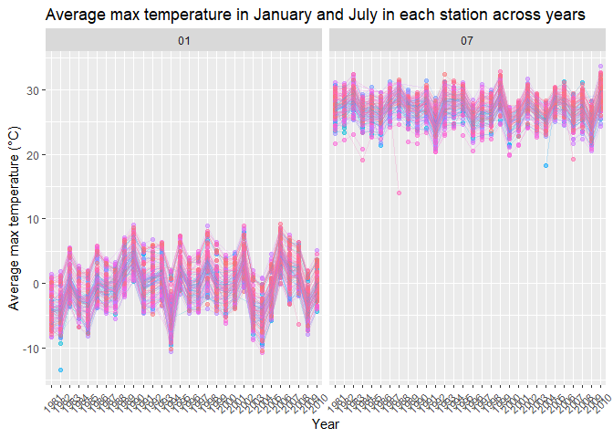
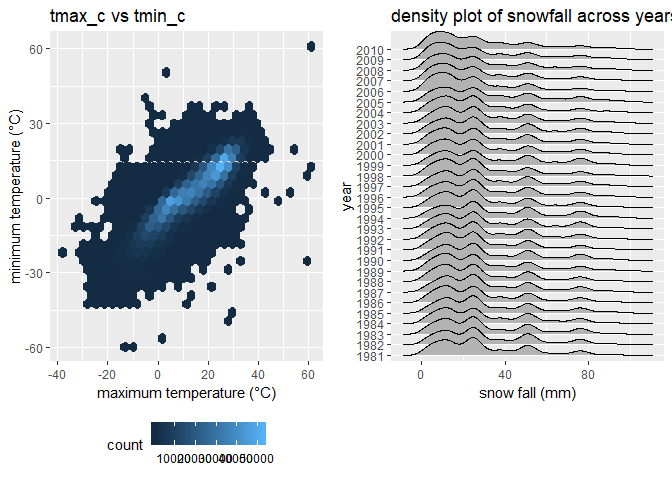

p8105\_hw3\_ml4239
================

P.1
===

data cleaning

``` r
# install.packages("devtools")
devtools::install_github("p8105/p8105.datasets")
```

    ## Skipping install of 'p8105.datasets' from a github remote, the SHA1 (21f5ad1c) has not changed since last install.
    ##   Use `force = TRUE` to force installation

``` r
library(p8105.datasets)
data("brfss_smart2010") 
brfss<-brfss_smart2010 %>% 
  janitor::clean_names() %>%  #format the data to use appropriate variable names;
  filter(topic == "Overall Health") %>% #focus on the “Overall Health” topic
  filter(response %in% c("Excellent", "Very good", "Good", "Fair", "Poor")) %>% #include only responses from “Excellent” to “Poor”
  mutate(response = forcats::fct_relevel(response, c("Excellent", "Very good", "Good", "Fair", "Poor"))) #organize responses as a factor taking levels ordered from “Excellent” to “Poor”
  str(brfss$response)
```

    ##  Factor w/ 5 levels "Excellent","Very good",..: 1 2 3 4 5 1 2 3 4 5 ...

1.1
---

In 2002, which states were observed at 7 locations?

``` r
brfss%>% 
  filter(year == 2002) %>% 
  group_by(year,locationabbr) %>% 
  summarise(n_location = n_distinct(locationdesc)) %>% 
  filter(n_location == 7)
```

    ## # A tibble: 3 x 3
    ## # Groups:   year [1]
    ##    year locationabbr n_location
    ##   <int> <chr>             <int>
    ## 1  2002 CT                    7
    ## 2  2002 FL                    7
    ## 3  2002 NC                    7

**Comments** In 2002, there are three states which were observed at 7 locations: CT, FL, NC

1.2
---

Make a “spaghetti plot” that shows the number of locations in each state from 2002 to 2010.

``` r
unique(brfss$year)
```

    ## [1] 2010 2009 2008 2007 2006 2005 2004 2003 2002

``` r
  brfss%>% 
    group_by(year,locationabbr) %>% 
    summarise(n_location = n_distinct(locationdesc)) %>% 
    ggplot(aes(x = year, y = n_location, color = locationabbr)) +
    geom_point() +
    geom_line() +
    labs(
    title = "Spaghetti plot of number of locations in each state from 2002 to 2010",
    x = "Year",
    y = "Number of locations"
  )
```



**Comments**the number of locations(distinct) in FL change the most from 2002 to 2010 expecially in 2007. In other states the distinct number of locations lies between 1 to 20 and do not change a lot.

1.3
---

Make a table showing, for the years 2002, 2006, and 2010, the mean and standard deviation of the proportion of “Excellent” responses across locations in NY State.

``` r
brfss %>% 
  filter(year %in% c(2002,2006,2010) & locationabbr == "NY") %>% 
  filter(response == "Excellent") %>% 
  group_by(year) %>% 
  summarise(mean_excellent = mean(data_value, na.rm = T),
            sd_excellent = sd(data_value, na.rm = T)) %>% 
  knitr::kable(digits = 3)
```

|  year|  mean\_excellent|  sd\_excellent|
|-----:|----------------:|--------------:|
|  2002|           24.040|          4.486|
|  2006|           22.533|          4.001|
|  2010|           22.700|          3.567|

**Comments**The mean proportions of “Excellent” responses across locations in NY State are quite similar between 2006 and 2010. And for 2002 the mean proportion is a little higher than 2006and 2010. The standard deviation of the proportion of “Excellent” responses across locations in NY State is the greatest for 2002, and 2010 has the lowest standart deviation.

1.4
---

For each year and state, compute the average proportion in each response category (taking the average across locations in a state). Make a five-panel plot that shows, for each response category separately, the distribution of these state-level averages over time.

``` r
brfss %>% 
  group_by(year, locationabbr, response) %>% 
  summarise(ave_proportion = mean(data_value)) %>% 
  ggplot(aes(x = year, y = ave_proportion, color = locationabbr))+
  geom_point()+
  geom_line()+
  facet_grid(~response) +
  labs(
    title = "Distribution of State-level Averages Proportion in Each Response for Each Year ",
    x = "Year",
    y = "Average proportion"
  ) +
  theme(axis.text.x = element_text(angle = 45, hjust = 0.5, vjust = 0.5,size = 8), legend.position = "right") 
```

    ## Warning: Removed 21 rows containing missing values (geom_point).

    ## Warning: Removed 1 rows containing missing values (geom_path).



**Comments**There are five clusters of data points in the spaghetti plots.The mean proportions of each response type have roughly the same center and range across states across years from 2002 to 2010.The distribution of average proportions of "Poor" responses has the least variation. The distribution of average proportions of "Very good" responses seems to have the greatest variation.

P.2
===

``` r
 data("instacart")
instacart %>% 
  anyNA()
```

    ## [1] FALSE

The dimension of the dataset is 1384617, 15.The dataset contains `nrow(instacart)` observations of `crow(instacart)` unique users. And there is no missing value. Each row shows some information about order,product and customer of an ordered product. There are r nrow(distinct(instacart, user\_id)) distinct users and r nrow(distinct(instacart, product\_id)) distinct products purchased by customers. The data structure of the dataset is `str(instacart)`. There are key descriptition variables: "product\_name" (such as "Bulgarian Yogurt","Organic Celery Hearts"),"department" (such as "dairy eggs"，"produce"，"canned goods",etc) and "ordered\_number"

2.1
---

How many aisles are there, and which aisles are the most items ordered from?

``` r
instacart %>% 
  summarise(aisles_unique = n_distinct(aisle))
```

    ## # A tibble: 1 x 1
    ##   aisles_unique
    ##           <int>
    ## 1           134

``` r
instacart %>% 
  group_by(aisle) %>% 
  summarize(n_by_aisle = n()) %>% 
  arrange(desc(n_by_aisle)) %>% 
  head(3)
```

    ## # A tibble: 3 x 2
    ##   aisle                      n_by_aisle
    ##   <chr>                           <int>
    ## 1 fresh vegetables               150609
    ## 2 fresh fruits                   150473
    ## 3 packaged vegetables fruits      78493

**Comments** There are 134 aisles recorded in the dataset. and the most items are ordered is from ailse `fresh vegetables`,`fresh fruits` and `packaged vegetables fruits` (The first two nearly the same and packaged vegetables fruites is half of the first two )

2.2
---

Make a plot that shows the number of items ordered in each aisle. Order aisles sensibly, and organize your plot so others can read it.

``` r
instacart %>%
  ggplot(aes(x = aisle, fill = department)) + 
  geom_bar()+
  coord_flip()+
  viridis::scale_color_viridis(discrete = TRUE)+
  theme(axis.text.x = element_text(angle = 90, hjust = 0.5, vjust = 0.5,size = 5.5),legend.position = "right")+
  labs(
    title = "scatterplot of number of items ordered from each aisle",
    x = "aisle name",
    y = "number of items"
  )
```



2.3
---

Make a table showing the most popular item in each of the aisles “baking ingredients”, “dog food care”, and “packaged vegetables fruits”.

``` r
instacart %>% 
  filter(aisle %in% c("baking ingredients", "dog food care", "packaged vegetables fruits")) %>% 
  group_by(aisle,product_name) %>% 
  summarise(n_product = n()) %>% 
  mutate(rank = min_rank(desc(n_product))) %>% 
  filter(rank < 2) %>% 
  knitr::kable()
```

| aisle                      | product\_name                                 |  n\_product|  rank|
|:---------------------------|:----------------------------------------------|-----------:|-----:|
| baking ingredients         | Light Brown Sugar                             |         499|     1|
| dog food care              | Snack Sticks Chicken & Rice Recipe Dog Treats |          30|     1|
| packaged vegetables fruits | Organic Baby Spinach                          |        9784|     1|

**Comments** Based on the table, we can tell that `Light Brown Sugar` is the most popular product in baking ingredients and it has been ordered 499. For dog food care, `Snack Sticks Chicken & Rice Recipe Dog Treats` is the most popular item in dog food care and and it has been ordered 30. `Organic Baby Spinach` is the most popular item in `packaged vegetables fruits` and it has been ordered 9784.

2.4
---

Make a table showing the mean hour of the day at which Pink Lady Apples and Coffee Ice Cream are ordered on each day of the week; format this table for human readers (i.e. produce a 2 x 7 table)

``` r
instacart %>% 
  filter(product_name %in% c("Pink Lady Apples", "Coffee Ice Cream")) %>% 
  group_by(product_name,order_dow) %>% 
  summarise(mean_hour = mean(order_hour_of_day)) %>% 
  spread(key = "order_dow", value = "mean_hour")  %>% 
  knitr::kable()
```

| product\_name    |         0|         1|         2|         3|         4|         5|         6|
|:-----------------|---------:|---------:|---------:|---------:|---------:|---------:|---------:|
| Coffee Ice Cream |  13.77419|  14.31579|  15.38095|  15.31818|  15.21739|  12.26316|  13.83333|
| Pink Lady Apples |  13.44118|  11.36000|  11.70213|  14.25000|  11.55172|  12.78431|  11.93750|

**Comments** Based on the table, we can tell that every day people tend to order Pink Lady Apples at arbound 11:00 to 14:30 and order Coffee Ice Cream at around 12:30 to 15:30. And the mean hour does not change a lot among different days in the week.

P.3
===

``` r
data("ny_noaa")
str(ny_noaa)
```

    ## Classes 'tbl_df', 'tbl' and 'data.frame':    2595176 obs. of  7 variables:
    ##  $ id  : chr  "US1NYAB0001" "US1NYAB0001" "US1NYAB0001" "US1NYAB0001" ...
    ##  $ date: Date, format: "2007-11-01" "2007-11-02" ...
    ##  $ prcp: int  NA NA NA NA NA NA NA NA NA NA ...
    ##  $ snow: int  NA NA NA NA NA NA NA NA NA NA ...
    ##  $ snwd: int  NA NA NA NA NA NA NA NA NA NA ...
    ##  $ tmax: chr  NA NA NA NA ...
    ##  $ tmin: chr  NA NA NA NA ...
    ##  - attr(*, "spec")=List of 2
    ##   ..$ cols   :List of 7
    ##   .. ..$ id  : list()
    ##   .. .. ..- attr(*, "class")= chr  "collector_character" "collector"
    ##   .. ..$ date:List of 1
    ##   .. .. ..$ format: chr ""
    ##   .. .. ..- attr(*, "class")= chr  "collector_date" "collector"
    ##   .. ..$ prcp: list()
    ##   .. .. ..- attr(*, "class")= chr  "collector_integer" "collector"
    ##   .. ..$ snow: list()
    ##   .. .. ..- attr(*, "class")= chr  "collector_integer" "collector"
    ##   .. ..$ snwd: list()
    ##   .. .. ..- attr(*, "class")= chr  "collector_integer" "collector"
    ##   .. ..$ tmax: list()
    ##   .. .. ..- attr(*, "class")= chr  "collector_character" "collector"
    ##   .. ..$ tmin: list()
    ##   .. .. ..- attr(*, "class")= chr  "collector_character" "collector"
    ##   ..$ default: list()
    ##   .. ..- attr(*, "class")= chr  "collector_guess" "collector"
    ##   ..- attr(*, "class")= chr "col_spec"

``` r
ny_noaa 
```

    ## # A tibble: 2,595,176 x 7
    ##    id          date        prcp  snow  snwd tmax  tmin 
    ##    <chr>       <date>     <int> <int> <int> <chr> <chr>
    ##  1 US1NYAB0001 2007-11-01    NA    NA    NA <NA>  <NA> 
    ##  2 US1NYAB0001 2007-11-02    NA    NA    NA <NA>  <NA> 
    ##  3 US1NYAB0001 2007-11-03    NA    NA    NA <NA>  <NA> 
    ##  4 US1NYAB0001 2007-11-04    NA    NA    NA <NA>  <NA> 
    ##  5 US1NYAB0001 2007-11-05    NA    NA    NA <NA>  <NA> 
    ##  6 US1NYAB0001 2007-11-06    NA    NA    NA <NA>  <NA> 
    ##  7 US1NYAB0001 2007-11-07    NA    NA    NA <NA>  <NA> 
    ##  8 US1NYAB0001 2007-11-08    NA    NA    NA <NA>  <NA> 
    ##  9 US1NYAB0001 2007-11-09    NA    NA    NA <NA>  <NA> 
    ## 10 US1NYAB0001 2007-11-10    NA    NA    NA <NA>  <NA> 
    ## # ... with 2,595,166 more rows

``` r
prop_tmax<-sum(is.na(ny_noaa$tmax))/nrow(ny_noaa)
prop_prcp<-sum(is.na(ny_noaa$prcp))/nrow(ny_noaa)
prop_snow<-sum(is.na(ny_noaa$snow))/nrow(ny_noaa)
prop_snwd<-sum(is.na(ny_noaa$snwd))/nrow(ny_noaa)
prop_tmin<-sum(is.na(ny_noaa$tmin))/nrow(ny_noaa)
```

**Comments** The dimensional of this dataset is 2595176, 7. And the key variables include station id, date of observation, precipitation, snowfall(mm), snow depth(mm), maximum temperature and minimum temprature on each day (both in tenths of degree C) from 1981-11-01 to 2010-12-31. There are many missing values in each variables: the proportion of missing value in tmin is 0.4371264 .The proportion of missing value in tmax is 0.4371025. The proportion of missing value in prcp is 0.0561958. The proportion of missing value in snwd is 0.2280331. The proportion of missing value in snow is 0.146896. From which we can tell that most of the stations only record precipitation but half of them missing the data about tmax and tmin. This is an issue.

3.1
---

Do some data cleaning. Create separate variables for year, month, and day. Ensure observations for temperature, precipitation, and snowfall are given in reasonable units. For snowfall, what are the most commonly observed values? Why?

``` r
ny_tidy<-ny_noaa %>% 
  separate(col = date, into = c("year", "month", "day"), sep = '-') %>% 
    mutate(tmax_c = as.numeric(tmax) /10,
         tmin_c = as.numeric(tmin) /10,
         prcp = as.numeric(prcp)/10,
         snow = as.numeric(snow),
         snwd = as.numeric(snwd)) 
ny_tidy %>% 
  count(snow) %>% 
  arrange(desc(n))
```

    ## # A tibble: 282 x 2
    ##     snow       n
    ##    <dbl>   <int>
    ##  1     0 2008508
    ##  2    NA  381221
    ##  3    25   31022
    ##  4    13   23095
    ##  5    51   18274
    ##  6    76   10173
    ##  7     8    9962
    ##  8     5    9748
    ##  9    38    9197
    ## 10     3    8790
    ## # ... with 272 more rows

**Comments** the most commonly observed value for snowfall is 0 because snow occurs only in winter. Most of the time in a year there will not be snow.

3.2
---

Make a two-panel plot showing the average max temperature in January and in July in each station across years. Is there any observable / interpretable structure? Any outliers?

``` r
ny_tidy %>% 
  filter(month%in% c("01", "07")) %>% 
  group_by(id, year, month) %>% 
  summarise(ave_tmax = mean(tmax_c)) %>% 
  ggplot(aes( x = year, y = ave_tmax, color = id,group = id))+
  geom_point(alpha = 0.5)+
  geom_line(alpha = 0.2)+
  facet_grid(~ month)+
  theme(axis.text.x = element_text(angle = 45, hjust = 0.5, vjust = 0.5,size = 8),legend.position = "none")+
  labs(
    title = "Average max temperature in January and July in each station across years",
    x = "Year",
    y = "Average max temperature (˚C)"
  )
```

    ## Warning: Removed 7058 rows containing missing values (geom_point).

    ## Warning: Removed 6007 rows containing missing values (geom_path).

 **Comments** In January the average max temperature in each station across the year is around 0 Celsius. In July the average max temperature in each station across the year is around 26 Celsius. There are some outliers such as 1982 January, 1984 July and 1988 July etc.

3.3
---

Make a two-panel plot showing (i) tmax vs tmin for the full dataset (note that a scatterplot may not be the best option); and (ii) make a plot showing the distribution of snowfall values greater than 0 and less than 100 separately by year.

``` r
hex<-ny_tidy %>% 
  ggplot(aes(x = tmax_c, y = tmin_c)) +
  geom_hex() + 
  theme(legend.position = "bottom") +
  labs(
    title = "tmax_c vs tmin_c",
    x = "maximum temperature (˚C)",
    y = "minimum temperature (˚C)"
  )

ridges<-ny_tidy %>%
  filter(snow < 100 & snow > 0) %>% 
  ggplot(aes(x = snow, y = year))+
  geom_density_ridges()+
  labs(
    title = "density plot of snowfall across years",
    x = "snow fall (mm)",
    y = "year"
  )
 
hex+ridges      
```

    ## Warning: Removed 1136276 rows containing non-finite values (stat_binhex).

    ## Picking joint bandwidth of 3.76



**Comment** In the first panel we can see there are some outliers far from the center but most of the tmin\_c and tmax\_x are in the middle of the plot.

In the second panel we can see there is no huge difference between the distribution of snowfall across the years. It mostly lies between 0 and 100.
